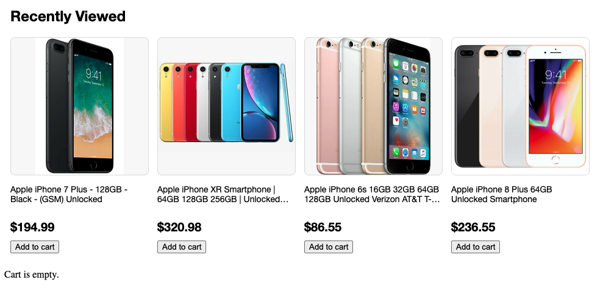

# This is a take home exercise for search FE position candidate

# Requirements:
 - Build a web page with a UI component to show recently reviewed items (4), each item has an image, title, price and add to cart button. UI mock as below:
 - Use the data specifications below to assemble and use the data in the most practical way you see fit.
 - When user clicks any one of the 'Add to cart' buttons, update the text of 'Cart is empty.' to 'Item x added in cart.' and make that button unclickable. 
 - [start file](index.html) is provided, add more files as needed. Please use the specs and raw data as below to build the UI.
 - Please refrain from including any third-party dependencies / frameworks. We would like to see what you can do using pure HTML / CSS / Javascript.
 - We anticipate this exercise to take around 2 hours or less to complete, so please keep this in mind when designing your solution. We aren't expecting you to go above and beyond - simply your demonstration of the fundamentals.
 
  

 
 ## Specs and raw data:
  ```
    Component title: font-size 24px, bolded
    
    Images:
        horizontally and vertically center aligned within a 225px square box, 
        background color: #f8f8f8, border radius: 8px; border: 1px solid #ddd
        source:
        https://i.ebayimg.com/thumbs/images/g/peQAAOSwJK9bh~Tm/s-l225.png,
        https://i.ebayimg.com/thumbs/images/g/2ZUAAOSw4pJd2XZh/s-l225.png,
        https://i.ebayimg.com/thumbs/images/g/ZcwAAOSw44peap3s/s-l225.png,
        https://i.ebayimg.com/thumbs/images/g/RHIAAOSwCtJaGbNC/s-l225.png

    Item title:
        font-size: 16px
        only display maximum two lines, if overflow use ... as shown in the item 2 and item 3 from the above UI mock
        text:
        Apple  iPhone 7 Plus - 128GB - Black - (GSM) Unlocked,
        Apple iPhone XR Smartphone | 64GB 128GB 256GB | Unlocked Verizon AT&T T-Mobile,
        Apple iPhone 6s 16GB 32GB 64GB 128GB Unlocked Verizon AT&T T-Mobile Smartphone,
        Apple iPhone 8 Plus 64GB Unlocked Smartphone

    Price: font-size: 20px, bolded
        prices:
        $194.99,
        $320.99,
        $86.55,
        $236.55
